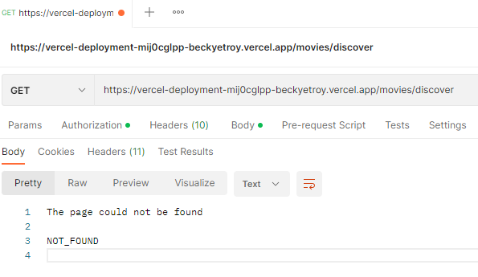

# Assignment 2 - Agile Software Practice.

Name: Rebecca Troy

## API endpoints.

The Web API's endpoints are listed below, along with their purpose.
 
 ### Movies:
- /api/movies/discover | GET | Gets the most up to date list of 21 discover movies from the TMDB API and updates the values in the MongoDB
- /api/movies/upcoming | GET | Gets the most up to date list of 21 upcoming movies from the TMDB API and updates the values in the MongoDB
- /api/movies/trending/week | GET | Gets the most up to date list of 21 trending movies this week from the TMDB API and updates the values in the MongoDB
- /api/movies/trending/today | GET | Gets the most up to date list of 21 trending movies today from the TMDB API and updates the values in the MongoDB
- /api/movies/{movieid} | GET | Get a more detailed view of a particular movie and, if not already done so, stores it in the MongoDB
- /api/movies/{movieid}/images | GET | Get the poster images for a particular movie and update the values in the MongoDB

### Genres:
- /api/genres | GET | Get all genres from the TMDB API

### People:
- /api/people/movie/{movieid}/credits | GET | Get all cast and crew members of a particular movie from the TMDB API and, if not already done so, stores it in the MongoDB
- /api/people/{personid} | GET | Get a more detailed view of a particular person and, if not already done so, stores it in the MongoDB

### Reviews:
- /api/reviews/{movieid} | GET | Get all reviews for a particular movie and update the values in the MongoDB
- /api/reviews/{movieid} | POST | Create a new review for a particular movie and add it to the MongoDB

### Users:
- /api/users | GET | Get all users registered with the MongoDB
- /api/users | POST | Authenticate / validate username and password passed through and, if successful, log the user in and generate JWT token
- /api/users?action=register | POST | Authenticate / validate username and password passed through and, if successful, register the user with the MongoDB
- /api/users/{username} | PUT | Update the user's password if valid and update the MongoDB accordingly
- /api/users/{username}/favourites | GET | Get all movies in user's favourites list
- /api/users/{username}/favourites | POST | Add a movie to the user's favourites list on the MongoDB
- /api/users/{username}/favourites?action=remove | POST | Remove a movie from the user's favourites list on the MongoDB
- /api/users/{username}/mustwatch | GET | Get all movies in user's must watch list
- /api/users/{username}/mustwatch | POST | Add a movie to the user's must watch list on the MongoDB
- /api/users/{username}/mustwatch?action=remove | POST | Remove a movie from the user's must watch list on the MongoDB

### Google:
- /api/google/ | GET | Loads the necessary modules and Client ID for Google API
- /api/google/authenticate | POST | Pass a generated authentication code through the API in exchange for access tokens
- api/google/signin | GET | Grants offline access to the modules to sign in can occur

As the Google endpoint does not work as expected, it is ignored in testing.

The API does not block routes at the server level. Instead, routes are blocked at the React-app level and therefore this is not tested for this assignment.

## Test cases.

This section lists the reponse printed to the console when running all of the tests locally. The output is as follows:

~~~
  Users endpoint
    GET /api/users
      √ should return the 2 added users and a status 200
      √ should show the same 2 users in the DB (82ms)
      √ should not return plaintext passwords in DB or API (81ms)
    POST /api/users
      For registering
        when credentials are missing
          when all details are missing
            √ should return a 401 status and error message
          when password is missing
            √ should return a 401 status and error message when password is missing
            √ should not update the DB
          when username is missing
            √ should return a 401 status and error message when username is missing
        when password is invalid
          √ should return a 401 status and error message
          √ should not update the DB (47ms)
        when credentials are valid
          √ should return a 201 status and the confirmation message (241ms)
          √ should update the DB (349ms)
          √ should not store plaintext password in DB (288ms)
        when username already exists
          √ should return a 401 status and error message
          √ should not update the DB (61ms)
      For logging in
        when credentials are missing
          √ should return a 401 status and error message when all details are missing
          √ should return a 401 status and error message when password is missing
          √ should return a 401 status and error message when username is missing
        when credentials are incorrect
          √ should return a 401 status and error message when username is incorrect
          √ should return a 401 status and error message when password is incorrect (262ms)
        when credentials are correct
          √ should return a 200 status and a generated token (240ms)
    PUT /api/users/:username
      when password is missing
        √ should return a 404 status and error message
      when password is valid
        √ should return a 200 status and confirmation message (310ms)
        √ should not store plaintext password in DB (310ms)
        logging in after update
          √ should fail log in with old password (231ms)
          √ should log in successfully with new password (267ms)
    GET /api/users/:username/favourites
      When username is valid
        √ should return the user's favourites and a status 200
        √ should show the same user favourites in the DB (56ms)
      When username is invalid
        √ should return an error message and status 404
    POST /api/users/:username/favourites
      When movie is not already favourited
        √ should return the user, including new favourite, and a 201 status (76ms)
        √ should update the DB (95ms)
      When movie is already favourited
        √ should return the user with no duplicate favourites and a 201 status
        √ should not update the DB (101ms)
      POST /api/users/:username/favourites?action=remove
        When username is invalid
          √ should return error message and 404 status
        When username is valid
          When movie is not favourited
            √ should return the user's favourites, excluding removed, and a 200 status (75ms)
            √ should not update the DB (84ms)
          When movie is favourited
            √ should return the user favourites without the posted favourite and a 200 status (60ms)
            √ should update the DB (102ms)
    GET /api/users/:username/mustwatch
      When username is valid
        √ should return the user's must watch movies and a status 200 (38ms)
        √ should show the same user must watch movies in the DB (59ms)
      When username is invalid
        √ should return an error message and status 404 (39ms)
    POST /api/users/:username/mustwatch
      When movie is not already added to must watch
        √ should return the user, including new must watch movie, and a 201 status (74ms)
        √ should update the DB (84ms)
      When movie is already a must watch movie
        √ should return the user with no duplicate must watch movies and a 201 status
        √ should not update the DB (93ms)
    POST /api/users/:username/mustwatch?action=remove
      When username is invalid
        √ should return error message and 404 status
      When username is valid
        When movie is not a must watch movie
          √ should return the user's must watch movies, excluding removed, and a 200 status (55ms)
          √ should not update the DB (94ms)
        When movie is a must watch movie
          √ should return the user must watch movies without the posted must watch movie and a 200 status (72ms)
          √ should update the DB (101ms)

  Movies endpoint
    GET /api/movies/discover
      √ should return 20 movies and a status 200 (194ms)
      √ should return the same movies pulled from TMDB API (173ms)
      √ should update the DB (724ms)
    GET /api/movies/upcoming
      √ should return 20 movies and a status 200 (225ms)
      √ should return the same movies pulled from TMDB API (253ms)
      √ should update the DB (788ms)
    GET /api/movies/trending/week
      √ should return 20 movies and a status 200 (170ms)
      √ should return the same movies pulled from TMDB API (184ms)
      √ should update the DB (612ms)
    GET /api/movies/trending/today
      √ should return 20 movies and a status 200 (214ms)
      √ should return the same movies pulled from TMDB API (220ms)
      √ should update the DB (681ms)
    GET /api/movies/:id
      when the id is valid
        √ should return the matching movie (194ms)
        √ should return the same movie pulled from TMDB API (154ms)
        √ should update the DB (158ms)
        √ should only update the DB once (315ms)
      when the id is invalid
        √ should return an error message (99ms)
        √ should not update the DB (122ms)
    GET /api/movies/:id/images
      when the movie hasn't been called previously
        √ should return an error message (137ms)
        √ should not update the DB (129ms)
      when the movie has been called previously
        when the id is valid
          √ should return the matching movie images (145ms)
          √ should return the same movie images pulled from TMDB API (136ms)
          √ should update the DB (175ms)
        when the id is invalid
          √ should return an error message (94ms)

  People endpoint
    GET /api/people/movie/:id/credits
      √ should return an array of cast, an array of crew and a status 200 (395ms)
      √ should return the same credits pulled from TMDB API (297ms)
      √ should update the DB (435ms)
      √ should only update the DB once (440ms)
    GET /api/people/:id
      when the id is valid
        √ should return the matching person (174ms)
        √ should return the same movie pulled from TMDB API (126ms)
        √ should update the DB (187ms)
      when the id is invalid
        √ should return an error message (93ms)
        √ should not update the DB (125ms)

  Reviews endpoint
    GET /api/reviews/:id
      when the movie hasn't been called previously
        √ should return an error message (132ms)
        √ should not update the DB (143ms)
      when the movie has been called previously
        when the id is valid
          √ should return the matching movie reviews (188ms)
          √ should return the same movie reviews pulled from TMDB API (132ms)
          √ should update the DB (190ms)
        when the id is invalid
          √ should return an error message (105ms)
    POST /api/reviews/:id
      when the movie hasn't been called previously
        √ should return an error message (139ms)
        √ should not update the DB (161ms)
      when the movie has been called previously
        when the id is valid
          √ should return a list of movie reviews and status 200 (278ms)
          √ should return the same movie reviews pulled from TMDB API AND the newly added one (204ms)
          √ should update the DB (230ms)

  Genres endpoint
    GET /api/genres
      √ should return an array of genres (73ms)
      √ should return the same genres pulled from TMDB API (92ms)
  95 passing (56s)
~~~

## Independent Learning

I attempted to implement Option A i.e. manually deploying a single endpoint from the Express App into a new project to the Vercel platform as a serverless function.

The project can be found [on this repository.](https://github.com/beckyetroy/vercel-deployment),
which also includes the link to the deployed project.

While the deployment succeeded and seemed to be configured as required, POSTMAN did not return
the data as expected. Find below a screenshot of the output:

Several different endpoints were attempted in order to get an expected output, but none were successful with POSTMAN for unknown reasons. All returned the above error.

Throughout the testing code, I learned and utilised several new JavaScript and chai (expect) commands, such as .deep.equal. I learned in particular how to test the contents of a MongoDB in extensive detail.